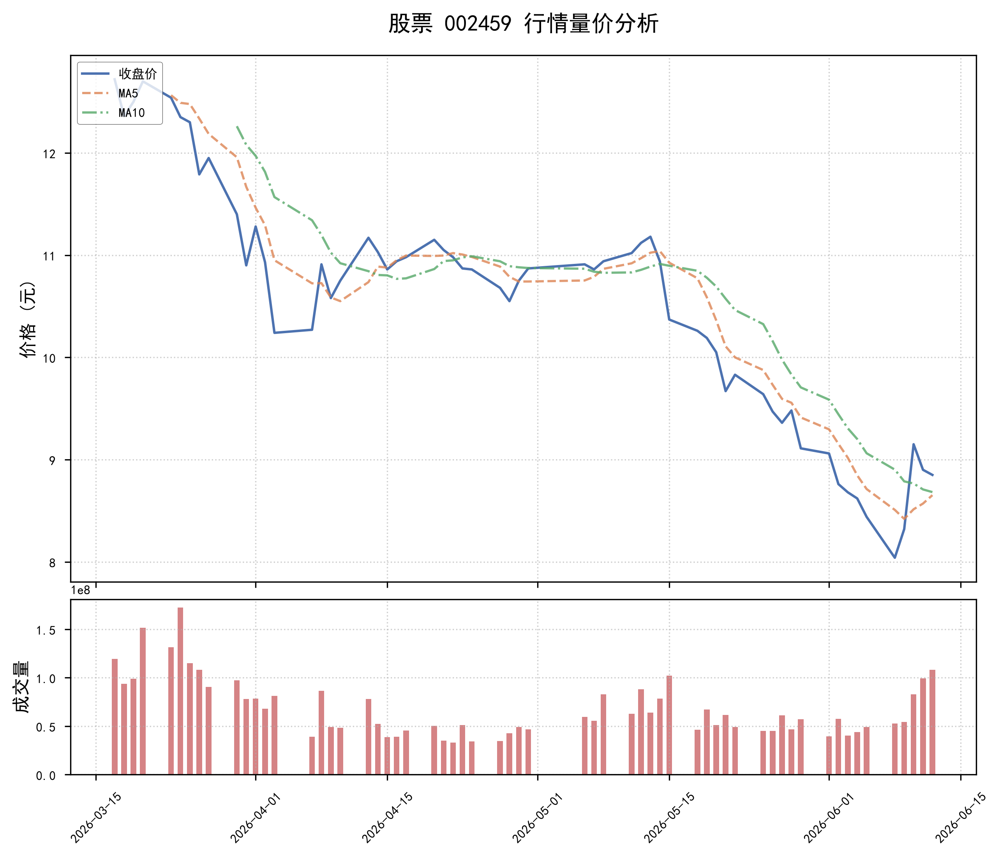

# 002459 短期深度投研报告：弱势格局延续，警惕下行风险

## 一、图表展示

## 二、走势回顾
该股近30个交易日（统计区间：约4月29日至6月12日）走出经典的“冲高-见顶-急跌-弱反弹”路径，整体弱势特征显著。

**上涨阶段（4月29日-5月14日）**：股价由10.75元附近启动，伴随成交量温和放大，一度上探至11.18元高点，期间成交峰值达7800万股以上，多头尝试上攻。

**顶部转折（5月15日）**：当日成交量激增至1.02亿股，为区间最大量，但股价却以光头大阴线报收，形成典型的高位放量下跌，显示主力资金出逃，趋势逆转信号明确。

**主跌阶段（5月15日-6月9日）**：股价自高点11.18元连阴下挫至最低7.92元，区间跌幅高达24%。下跌过程中成交量逐步萎缩至4000万股附近，虽有杀跌动能衰减，但买盘匮乏，空头牢牢掌控主动。

**超跌反弹与再受阻（6月10日-6月12日）**：6月10日股价以涨停或接近涨停之势反弹至9.15元，成交8273万股，但后续两个交易日成交继续放大至9919万、1.08亿股，股价却分别回落，终收于8.85元。典型“放量滞涨”乃至“放量下跌”形态，意味着上方抛压沉重，多头反攻失败，反弹质变为出货窗口。

## 三、技术指标分析
我们基于近30日收盘价计算的核心指标如下：

| 指标 | 数值 | 分析解读 |
|------|------|----------|
| MA5（5日均线） | 8.652 | 短期平均成本，当前股价8.85元勉强站上MA5，但MA5仍在下行中，支撑有效性存疑。 |
| MA10（10日均线） | 8.682 | 中期平均成本，MA5已下穿MA10形成死叉，均线呈空头排列，股价上方考验MA10压力。 |
| RSI（相对强弱指标） | 37.846 | 位于50中性值下方，处于弱势区间（但未进入20以下超卖极值）。反映反弹动能有限，趋势性走强仍需时间消化。 |

**指标综评**：均线系统空头排列，RSI弱势难改，短期即便有脉冲式反弹，也难以突破10日均线压制，技术结构仍指向探底或低位震荡格局。

## 四、风险提示

- **趋势风险**：当前处于中期下行通道内，5月15日形成的放量顶部构成强压力区，股价反弹未改下跌中继形态，后续若无法有效站稳9元关口并收复MA10，则二次探底甚至创出新低的风险较大。
- **量价背离风险**：反弹过程出现连续放量滞涨、放量下跌，显示资金逢高出逃意愿坚决，存量博弈下多头难以形成合力，需警惕反弹快速终结后的多杀多。
- **波动风险**：RSI未现超卖但股价急跌后振幅放大，市场情绪敏感，一旦大盘系统性走弱或个股负面催化，可能触发加速下跌。
- **流动性风险**：下跌段量能萎缩，虽部分反映杀跌动力减弱，但亦表明承接力不足，较大卖出盘可能引发价格滑点。

**风险等级：高**

## 五、投资建议

**短期策略：观望偏空，规避追高**

- 已持仓投资者：建议利用盘中反抽逐步降低仓位，尤其是在股价触及9.0-9.2元压力区时可考虑减持，止损参考近期低点7.92元附近。
- 空仓投资者：当前并未出现明确的右侧企稳信号（如连续缩量筑底、长阳突破均线压制并回踩确认），建议保持耐心，等待RSI回升至50以上且均线走平粘合后再行布局。
- 关注要点：后续需观察指数环境及量能变化，若缩量回踩前低不破并出现底分型结构，或将迎来阶段性修复机会；但放量跌破7.92元则需无条件离场。

**（声明：以上分析基于公开历史数据与技术指标，不构成任何投资决策的直接依据，市场有风险，投资需谨慎。）**